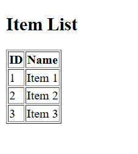

# Java Spring Boot + Angular Starter Application

## Overview

This repository serves as a **starter template** for full-stack applications built with **Java Spring Boot (backend)** and **Angular (frontend)**.  
Its purpose is to provide a minimal, clean, and ready-to-go project structure so you can **fast-track your development** of future projects by starting with this setup.

---

## Project Structure

```bash
| Root
├── backend/ # Spring Boot backend application (Java)
├── frontend/ # Angular frontend application (Standalone components)
├── README.md # This file
├── .gitignore
```


- `backend/` contains the Spring Boot REST API with a simple model, service, controller, and in-memory H2 database.
- `frontend/` contains a standalone Angular application that calls the backend and displays a list of items.

---

## Prerequisites

- **Java JDK 21+** installed and configured in your PATH  
- **Maven** installed (for backend build)  
- **Node.js 21.2+** and **npm** installed (for frontend)  
- **Angular CLI** installed globally (optional, but useful):  
  ```bash
  npm install -g @angular/cli
  ```


## Setup and Run Instructions

### Backend
##### Navigate to the backend folder:

```bash
cd backend
```

##### Build the project using Maven:
```bash
mvn clean package
```
##### Run the Spring Boot application:

```bash
mvn spring-boot:run
```

##### The backend API will be running at:

```bash
http://localhost:8080
```

### Frontend

##### Navigate to the frontend folder:

```bash
cd frontend
```


##### Install dependencies:

```bash
npm install
```

##### Run the Angular development server:

```bash
npm start
```

##### The frontend app will be served at:

```bash
http://localhost:4200
```

It should look like this:




These items are added on **BackendApplication.java**

```java
// Imports

@SpringBootApplication
public class BackendApplication {

    public static void main(String[] args) {
        SpringApplication.run(BackendApplication.class, args);
    }

    @Bean
    CommandLineRunner initDatabase(ItemRepository itemRepository) {
        return args -> {
            itemRepository.save(new Item("Item 1"));
            itemRepository.save(new Item("Item 2"));
            itemRepository.save(new Item("Item 3"));
        };
    }
}

```

## Notes
- The frontend app fetches data from the backend API running on port 8080.

- You can customize the model, services, and components to fit your project needs.

- This template uses Angular standalone components and the latest recommended Angular patterns (like provideHttpClient()).

## Contributing
Feel free to fork and adapt this template for your own projects. Pull requests and suggestions to improve this starter kit are welcome!

## License
This project is licensed under the **MIT License**.