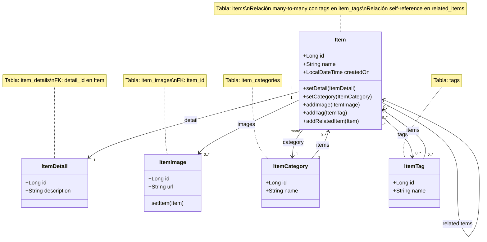

# UML de entidades del paquete example

Este diagrama representa las entidades JPA principales del módulo example y sus relaciones de dominio.

## Descripción de relaciones

- Item tiene un ItemDetail obligatorio: relación one-to-one.
- Item pertenece a una ItemCategory: relación many-to-one.
- Item puede tener muchas imágenes: relación one-to-many.
- Item puede tener muchos tags: relación many-to-many mediante la tabla item_tags.
- Item puede tener otros items relacionados: relación many-to-many self-reference mediante la tabla related_items.
- ItemCategory tiene varios items asociados.
- ItemTag puede estar asociado a varios items.
